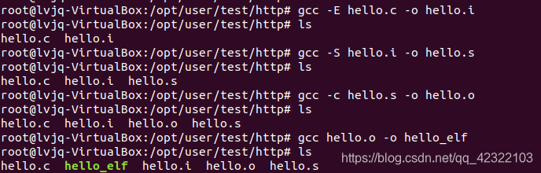
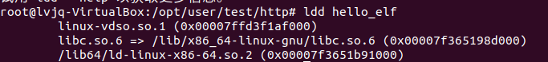

# C程序编译步骤

C代码编译成可执行程序经过4步：
1）预处理：宏定义展开、头文件展开、条件编译等，同时将代码中的注释删除，这里并不会检查语法
2）编译：检查语法，将预处理后文件编译生成汇编文件
3）汇编：将汇编文件生成目标文件(二进制文件)
4）链接：C语言写的程序是需要依赖各种库的，所以编译之后还需要把库链接到最终的可执行程序中去


这里用gcc展示一下编译过程

vim hello.c


| 操作   | 指令                        |
| ------ | --------------------------- |
| 预处理 | gcc -E hello.c -o hello.i   |
| 编  译 | gcc -S hello.i -o hello.s   |
| 汇 编  | gcc -c hello.s -o hello.o   |
| 链  接 | gcc    hello.o -o hello_elf |



执行：


可以查看一下程序所依赖的动态库



.so结尾的都是库

libc是c的代码库，linux-gnu是Linux的标准协议，libc.so.6满足这个标准
下面的那个是Linux的平台库


| 选项      | 含义                       |
| --------- | -------------------------- |
| -E        | 只进行预处理               |
| -S (大写) | 只进行预处理和编译         |
| -c (小写) | 只进行预处理、编译和汇编   |
| -o file   | 指定生成的输出文件名为file |


| 文件后缀 | 含义                |
| -------- | ------------------- |
| .c       | C语言文件           |
| .i       | 预处理后的C语言文件 |
| .s       | 编译后的汇编文件    |
| .o       | 编译后的目标文件    |

注意这里没有贴分步编译后的文件的内容，但是里面的内容很有价值一定要看一看。一定要联系前面C代码编译成可执行程序经过4步的文字描述

一步编译的情况也演示一下吧：

关于执行：
我们的程序文件存在于外存储器，要读到内存中进行执行，这个时候就涉及缓存和寄存器，CPU相关的东西了。计算机组成原理（或者说计算机系统）方面的知识就不多赘述，不然篇幅太长了。

————————————————

```
版权声明：本文为博主原创文章，遵循 CC 4.0 BY-SA 版权协议，转载请附上原文出处链接和本声明。
```

原文链接：https://blog.csdn.net/qq_42322103/article/details/99071161/
