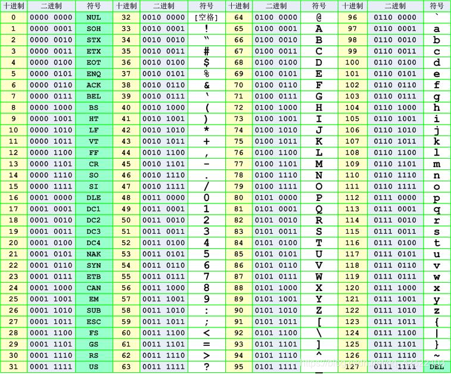

在 C 语言中，`char` 类型用于存储单个字符，占用 1 字节空间。字符变量实际存储的是字符的 ASCII 码值。以下是 `char` 类型的详细内容及其相关操作。



### `char` 类型与 ASCII 表

- `char` 类型的变量本质上是一个 1 字节的整数类型，存储 ASCII 码值，范围为 -128 到 127。
- `unsigned char` 类型则范围从 0 到 255。
- 常见的 ASCII 码值：
  - 小写字母 a 对应 97，A 对应 65，空格对应 32。

### `char` 类型的操作示例

```c
#include <stdio.h>

int main() {
    char ch = 'a';
    printf("sizeof(ch) = %u\n", sizeof(ch)); // 输出 char 的大小
  
    printf("ch[%%c] = %c\n", ch); // 打印字符
    printf("ch[%%d] = %d\n", ch); // 打印字符对应的 ASCII 值

    char A = 'A';
    printf("小写 a 的 ASCII: %d\n", 'a');  // 97
    printf("大写 A 的 ASCII: %d\n", 'A');  // 65
  
    // 字符转换
    printf("小写 'a' 转大写: %c\n", 'a' - 32); // 'A'
    printf("大写 'A' 转小写: %c\n", 'A' + 32); // 'a'

    // 空格的 ASCII 值
    printf("空字符的 ASCII 值: %d\n", ' '); // 32

    return 0;
}
```

### ASCII 表的组成

- **控制字符**：0-31，用于控制设备操作，如换行、回车。
- **打印字符**：32-126，能在键盘上找到的字符，如字母、数字和标点符号。

### 常用转义字符


| 转义字符 | 含义             | ASCII 码值 |
| -------- | ---------------- | ---------- |
| `\a`     | 警报             | 007        |
| `\b`     | 退格             | 008        |
| `\f`     | 换页             | 012        |
| `\n`     | 换行             | 010        |
| `\r`     | 回车             | 013        |
| `\t`     | 水平制表         | 009        |
| `\\`     | 反斜杠           | 092        |
| `\'`     | 单引号           | 039        |
| `\"`     | 双引号           | 034        |
| `\?`     | 问号             | 063        |
| `\0`     | 数字 0           | 000        |
| `\ddd`   | 八进制转义字符   | -          |
| `\xhh`   | 十六进制转义字符 | -          |

### 数值溢出示例

在字符操作中，当超过数据类型的取值范围时会发生溢出。

```c
#include <stdio.h>

int main() {
    char ch;
    ch = 0x7f + 2; // 127 + 2，符号位溢出
    printf("符号位溢出: %d\n", ch); // 结果为 -127

    unsigned char ch2;
    ch2 = 0xff + 1; // 255 + 1，最高位溢出
    printf("无符号字符最高位溢出: %u\n", ch2); // 结果为 0

    return 0;
}
```

### `char` 类型的总结


| 数据类型        | 占用空间 | 取值范围    | 描述       |
| --------------- | -------- | ----------- | ---------- |
| `char`          | 1 字节   | -128 到 127 | 有符号字符 |
| `unsigned char` | 1 字节   | 0 到 255    | 无符号字符 |

通过了解 `char` 类型的本质，可以更有效地进行字符处理和 ASCII 值操作。同时，注意溢出行为及其在有符号和无符号字符类型下的区别，有助于提高代码的安全性和可靠性。
