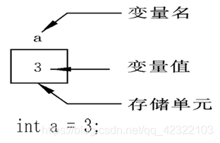

## **字面量** 或 **直接常量**：

在程序运行过程中，其值不能被改变的量
常量一般出现在表达式或赋值语句中

### 整型常量 100，200，-100，0

### 实型常量 3.14 ， 0.125，-3.123

### 字符型常量 ‘a’,‘b’,‘1’,‘\n’

### 字符串常量 “a”,“ab”，“12356”

## 具名常量

通过 `const` 关键字修饰的变量。这类常量有名字，有数据类型，存储在特定的内存位置，可以通过名字引用。例如 `const int MAX = 100;`。`const` 常量是一种具名常量，可以在程序中反复使用，并具有类型检查等安全特性。

## 变量：

在程序运行过程中，其值可以改变
变量在使用前必须先定义，定义变量前必须有相应的数据类型

### 标识符命名规则：

标识符不能是关键字

标识符只能由字母、数字、下划线组成
第一个字符必须为字母或下划线
标识符中字母区分大小写

### 变量特点：

变量在编译时为其分配相应的内存空间
可以通过其名字和地址访问相应内存

————————————————

                        版权声明：本文为博主原创文章，遵循 CC 4.0 BY-SA 版权协议，转载请附上原文出处链接和本声明。
原文链接：https://blog.csdn.net/qq_42322103/article/details/99071161/
