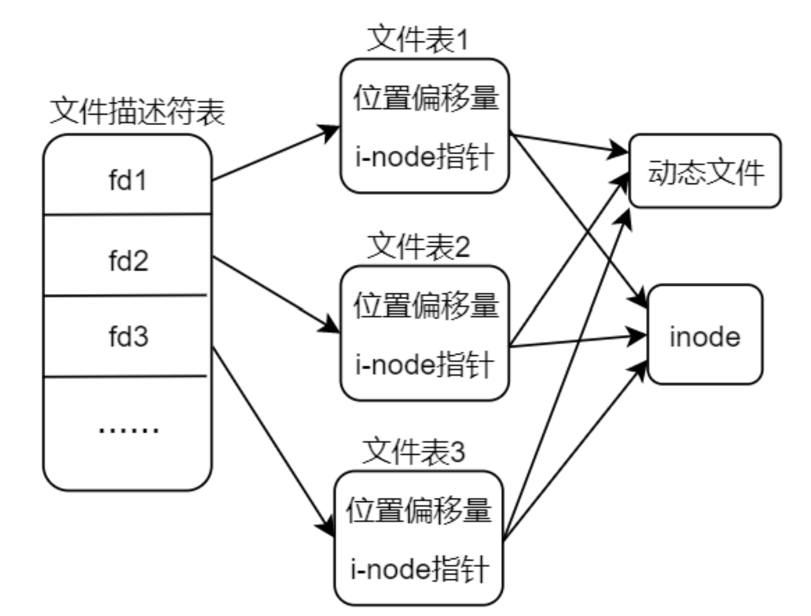

1. 一个进程内多次 open 打开同一个文件，那么会得到多个不同的文件描述符 fd，同理在关闭文件的时候也需要调用 close 依次关闭各个文件描述符。
2. 一个进程内多次 open 打开同一个文件，在内存中并不会存在多份动态文件
3. 一个进程内多次 open 打开同一个文件，不同文件描述符所对应的读写位置偏移量是相互独立的。
4. 多个不同的进程中调用 open()打开磁盘中的同一个文件，同样在内存中也只是维护了一份动态文件，多个进程间共享，它们有各自独立的文件读写位置偏移量。
5. 动态文件何时被关闭呢？当文件的引用计数为 0 时，系统会自动将其关闭，同一个文件被打开多次，文件表中会记录该文件的引用计数，如图 3.1.5 所示，引用计数记录了当前文件被多少个文件描述符 fd 关联。

