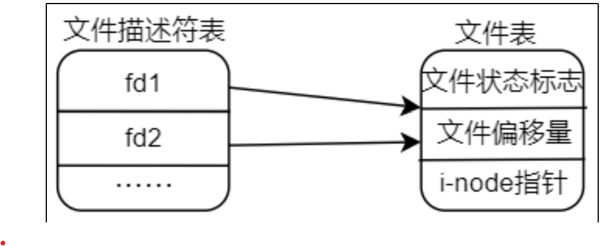

# 复制文件描述符

在 Linux 系统中，open 返回得到的文件描述符 fd 可以进行复制，复制成功之后可以得到一个新的文件

描述符，使用新的文件描述符和旧的文件描述符都可以对文件进行 IO 操作，复制得到的文件描述符和旧的

文件描述符拥有相同的权限，譬如使用旧的文件描述符对文件有读写权限，那么新的文件描述符同样也具

有读写权限；在 Linux 系统下，可以使用 dup 或 dup2 这两个系统调用对文件描述符进行复制，本小节就给

大家介绍这两个函数的用法以及它们之间的区别。

复制得到的文件描述符与旧的文件描述符都指向了同一个文件表，假设 fd1 为原文件描述符，fd2 为复

制得到的文件描述符，如下图所示：



图 3.7.1 指向同一个文件表

因为复制得到的文件描述符与旧的文件描述符指向的是同一个文件表，所以可知，这两个文件描述符的

属性是一样，譬如对文件的读写权限、文件状态标志、文件偏移量等，所以从这里也可知道“复制”的含义

实则是复制文件表。同样，在使用完毕之后也需要使用 close 来关闭文件描述符。


### dup 函数

dup 函数用于复制文件描述符，此函数原型如下所示（可通过"man 2 dup"命令查看）：

```
#include unistd.h;
int dup(int oldfd);
```

首先使用此函数需要包含头文件<unistd.h>。

函数参数和返回值含义如下：

oldfd：需要被复制的文件描述符。

返回值：成功时将返回一个新的文件描述符，由操作系统分配，分配置原则遵循文件描述符分配原则；

如果复制失败将返回-1，并且会设置 errno 值。

通过复制文件描述符可以实现接续写。

## dup2

dup 系统调用分配的文件描述符是由系统分配的，遵循文件描述符分配原则，并不能自己指定一个文件

描述符，这是 dup 系统调用的一个缺陷；而 dup2 系统调用修复了这个缺陷，可以手动指定文件描述符，而

不需要遵循文件描述符分配原则，当然在实际的编程工作中，需要根据自己的情况来进行选择。

dup2 函数原型如下所示（可以通过"man 2 dup2"命令查看）：

```
#include unistd.hint 
dup2(int oldfd, int newfd);
```

同样使用该命令也需要包含<unistd.h>头文件。

函数参数和返回值含义如下：

oldfd：需要被复制的文件描述符。

newfd：指定一个文件描述符（需要指定一个当前进程没有使用到的文件描述符）。

返回值：成功时将返回一个新的文件描述符，也就是手动指定的文件描述符 newfd；如果复制失败将返

回-1，并且会设置 errno 值。
