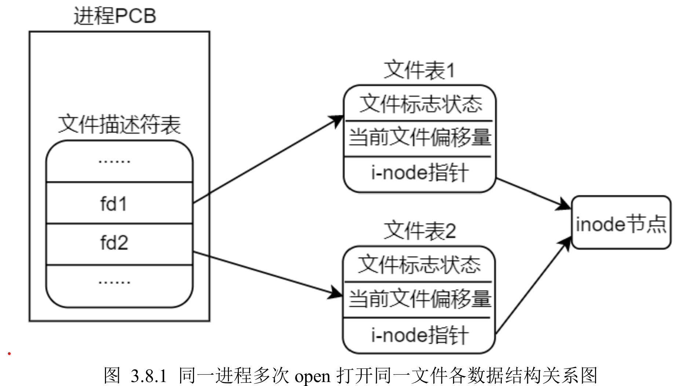
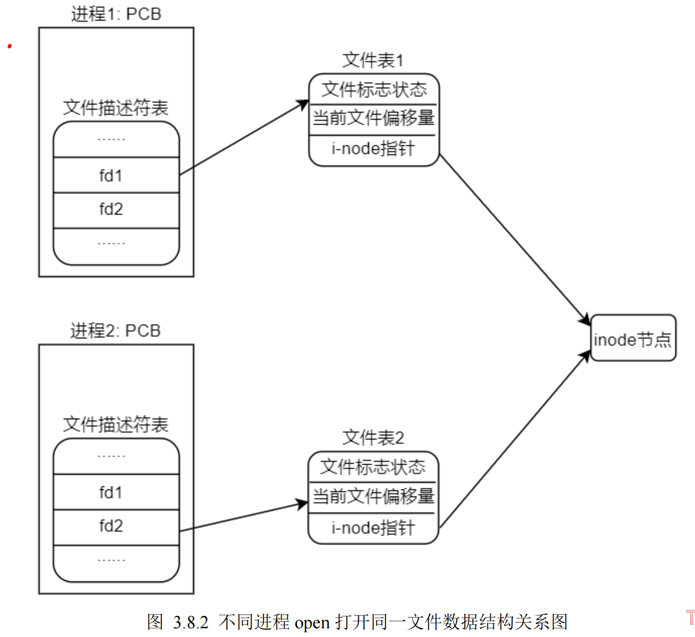
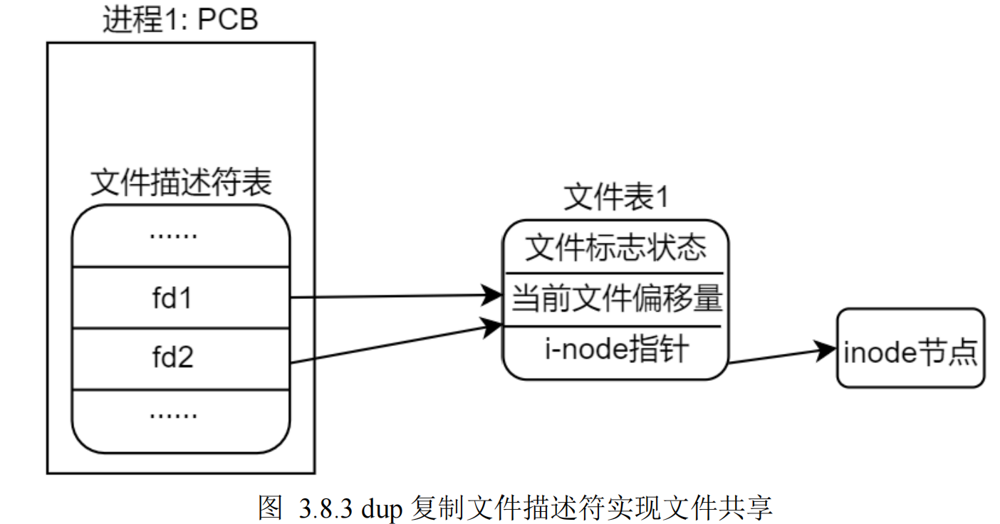

# 文件共享

什么是文件共享？所谓文件共享指的是同一个文件（譬如磁盘上的同一个文件，对应同一个 inode）被

多个独立的读写体同时进行 IO 操作。多个独立的读写体大家可以将其简单地理解为对应于同一个文件的多

个不同的文件描述符，譬如多次打开同一个文件所得到的多个不同的 fd，或使用 dup()（或 dup2）函数复制

得到的多个不同的 fd 等。

同时进行 IO 操作指的是一个读写体操作文件尚未调用 close 关闭的情况下，另一个读写体去操作文件，

前面给大家编写的示例代码中就已经涉及到了文件共享的内容了，譬如 3.6 小节中编写的示例代码中，同一

个文件对应两个不同的文件描述符 fd1 和 fd2，当使用 fd1 对文件进行写操作之后，并没有关闭 fd1，而此时

使用 fd2 对文件再进行写操作，这其实就是一种文件共享。

文件共享的意义有很多，多用于多进程或多线程编程环境中，譬如我们可以通过文件共享的方式来实现

多个线程同时操作同一个大文件，以减少文件读写时间、提升效率。

文件共享的核心是：

> ### 如何制造出多个不同的文件描述符来指向同一个文件。

其实方法在上面的内容中都已经给大家介绍过了，譬如多次调用 open 函数重复打开同一个文件得到多个不同的文件描述符、使用 dup()

或 dup2()函数对文件描述符进行复制以得到多个不同的文件描述符。

## 常见的三种文件共享的实现方式

### (1)同一个进程中多次调用 open 函数打开同一个文件，各数据结构之间的关系如下图所示：

详见 多次打开同一个文件.md

图

这种情况非常简单，多次调用 open 函数打开同一个文件会得到多个不同的文件描述符，并且多个文件

描述符对应多个不同的文件表，所有的文件表都索引到了同一个 inode 节点，也就是磁盘上的同一个文件。

### (2)不同进程中分别使用 open 函数打开同一个文件，其数据结构关系图如下所示：

进程 1 和进程 2 分别是运行在 Linux 系统上两个独立的进程（理解为两个独立的程序），在他们各自的

程序中分别调用 open 函数打开同一个文件，进程 1 对应的文件描述符为 fd1，进程 2 对应的文件描述符为

fd2，fd1 指向了进程 1 的文件表 1，fd2 指向了进程 2 的文件表 2；各自的文件表都索引到了同一个 inode 节

点，从而实现共享文件。

(3)同一个进程中通过 dup（dup2）函数对文件描述符进行复制，其数据结构关系如下图所示：

详见 复制文件描述符.md

这种方式上一小节已经给大家进行了详细讲解，这里不再重述！

对于文件共享，存在着竞争冒险，这个是需要大家关注的，下一小节将会向大家介绍。除此之外，我们

还需要关心的是文件共享时，不同的读写体之间是分别写还是接续写，这些细节问题大家都要搞清楚。
