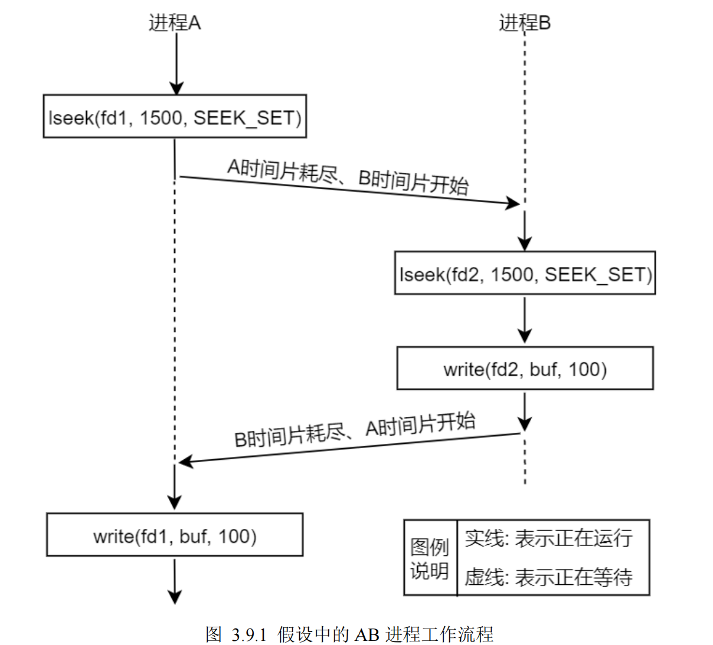

Linux 是一个多任务、多进程操作系统，系统中往往运行着多个不同的进程、任务，多个不同的进程就

有可能对同一个文件进行 IO 操作，此时该文件便是它们的共享资源，它们共同操作着同一份文件；操作系

统级编程不同于大家以前接触的裸机编程，裸机程序中不存在进程、多任务这种概念，而在 Linux 系统中，

我们必须要留意到多进程环境下可能会导致的竞争冒险。

# 竞争冒险简介

本小节给大家竞争冒险这个概念，如果学习过 Linux 驱动开发的读者对这些概念应该并不陌生，也就意味着

> #### 竞争冒险不但存在于 Linux 应用层、也存在于 Linux 内核驱动层。

假设有两个独立的进程 A 和进程 B 都对同一个文件进行追加写操作（也就是在文件末尾写入数据），

每一个进程都调用了 open 函数打开了该文件，但未使用 O\_APPEND 标志，此时，各数据结构之间的关系

如图 3.8.2 所示。

> ### 每个进程都有它自己的进程控制块 PCB，有自己的文件表（意味着有自己独立的读写位置偏移量），

但是共享同一个 inode 节点（也就是对应同一个文件）。假定此时进程 A 处于运行状态，B 未处

于等待运行状态，进程 A 调用了 lseek 函数，它将进程 A 的该文件当前位置偏移量设置为 1500 字节处（假

设这里是文件末尾），刚好此时进程 A 的时间片耗尽，然后内核切换到了进程 B，进程 B 执行 lseek 函数，

也将其对该文件的当前位置偏移量设置为 1500 个字节处（文件末尾）。然后进程 B 调用 write 函数，写入

了 100 个字节数据，那么此时在进程 B 中，该文件的当前位置偏移量已经移动到了 1600 字节处。B 进程时

间片耗尽，内核又切换到了进程 A，使进程 A 恢复运行，当进程 A 调用 write 函数时，是从进程 A 的该文

件当前位置偏移量（1500 字节处）开始写入，此时文件 1500 字节处已经不再是文件末尾了，如果还从 1500

字节处写入就会覆盖进程 B 刚才写入到该文件中的数据。

图 3.9.1 假设中的 AB 进程工作流程

以上给大家所描述的这样一种情形就属于竞争状态（也成为竞争冒险），操作共享资源的两个进程（或

线程），其操作之后的所得到的结果往往是不可预期的，因为每个进程（或线程）去操作文件的顺序是不可

预期的，即这些进程获得 CPU 使用权的先后顺序是不可预期的，完全由操作系统调配，这就是所谓的竞争

状态。

既然存在竞争状态，那么该如何规避或消除这种状态呢？接下来给大家介绍原子操作。
