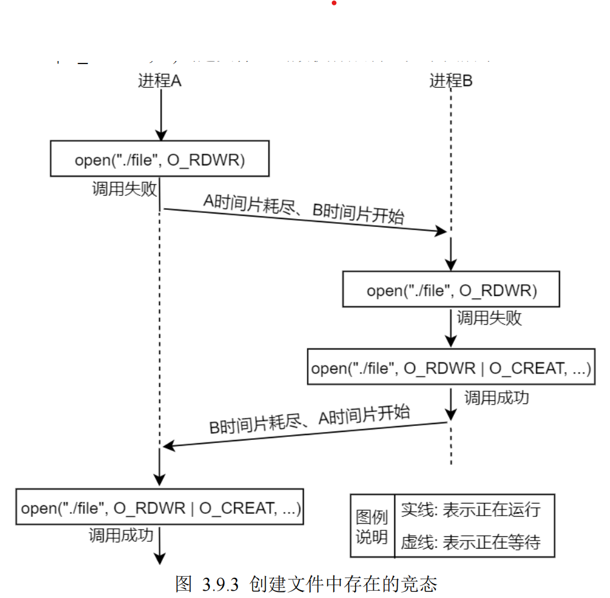

# 原子操作

在上一章给大家介绍 open 函数的时候就提到过“原子操作”这个概念了，同样在 Linux 驱动编程中，

也有这个概念，相信学习过 Linux 驱动编程开发的读者应该有印象。

从上一小节给大家提到的示例中可知，+

> ### 上述的问题(竞争冒险)出在逻辑操作“先定位到文件末尾，然后再写”，

它使用了两个分开的函数调用，首先使用 lseek 函数将文件当前位置偏移量移动到文件末尾、然后在使用 write

函数将数据写入到文件。既然知道了问题所在，那么解决办法就是将这两个操作步骤合并成一个原子操作，

所谓原子操作，是有多步操作组成的一个操作，原子操作要么一步也不执行，一旦执行，必须要执行完所有

步骤，不可能只执行所有步骤中的一个子集。

## (1)O\_APPEND 实现原子操作

在上一小节给大家提到的示例中，进程 A 和进程 B 都对同一个文件进行追加写操作，导致进程 A 写入

的数据覆盖了进程 B 写入的数据，解决办法就是将“先定位到文件末尾，然后写”这两个步骤组成一个原

子操作即可，那如何使其变成一个原子操作呢？答案就是 O\_APPEND 标志。

前面已经给大家多次提到过了 O\_APPEND 标志，但是并没有给大家介绍 O\_APPEND 的一个非常重要

的作用，那就是实现原子操作。当 open 函数的 flags 参数中包含了 O\_APPEND 标志，每次执行 write 写入

操作时都会将文件当前写位置偏移量移动到文件末尾，然后再写入数据，这里“移动当前写位置偏移量到文

件末尾、写入数据”这两个操作步骤就组成了一个原子操作，加入 O\_APPEND 标志后，不管怎么写入数据

都会是从文件末尾写，这样就不会导致出现“进程 A 写入的数据覆盖了进程 B 写入的数据”这种情况了。

## (2)pread()和 pwrite()

pread()和 pwrite()都是系统调用，与 read()、write()函数的作用一样，用于读取和写入数据。区别在于，

pread()和 pwrite()可用于实现原子操作，调用 pread 函数或 pwrite 函数可传入一个位置偏移量 offset 参数，

用于指定文件当前读或写的位置偏移量，

> ### 所以调用 pread 相当于调用 lseek 后再调用 read；

> ### 同理，调用 pwrite相当于调用 lseek 后再调用 write。

所以可知，使用 pread 或 pwrite 函数不需要使用 lseek 来调整当前位置偏

移量，并会将“移动当前位置偏移量、读或写”这两步操作组成一个原子操作。

pread、pwrite 函数原型如下所示（可通过"man 2 pread"或"man 2 pwrite"命令来查看）：

```
#include <unistd.h>
ssize_t pread(int fd, void *buf, size_t count, off_t offset);
ssize_t pwrite(int fd, const void *buf, size_t count, off_t offset);
```

首先调用这两个函数需要包含头文件<unistd.h>。

函数参数和返回值含义如下：

fd、buf、count 参数与 read 或 write 函数意义相同。

offset：表示当前需要进行读或写的位置偏移量。

返回值：返回值与 read、write 函数返回值意义一样。

虽然 pread（或 pwrite）函数相当于 lseek 与 pread（或 pwrite）函数的集合，但还是有下列区别：

> ### ⚫ 调用 pread 函数时，无法中断其定位和读操作（也就是原子操作）；

> ### ⚫ 不更新文件表中的当前位置偏移量。

关于第二点我们可以编写一个简单地代码进行测试，测试代码如下所示：

```c
#include <sys/types.h>

#include <sys/stat.h>

#include <fcntl.h>

#include <unistd.h>

#include <stdio.h>

#include <stdlib.h>

int main(void)

{

unsigned char buffer[100];

int fd;

int ret;

/\* 打开文件 test\_file \*/

fd = open("./test\_file", O\_RDWR);

if (-1 == fd) {

perror("open error");

exit(-1);

}

/\* 使用 pread 函数读取数据(从偏移文件头 1024 字节处开始读取) \*/

ret = pread(fd, buffer, sizeof(buffer), 1024);

if (-1 == ret) {

perror("pread error");

goto err;

}

/\* 获取当前位置偏移量 \*/

ret = lseek(fd, 0, SEEK\_CUR);

if (-1 == ret) {

perror("lseek error");

goto err;

}

printf("Current Offset: %d\\n", ret);

ret = 0;

err:

/\* 关闭文件 \*/

close(fd);

exit(ret);

}
```

示例代码 3.9.1 pread 函数测试


在当前目录下存在一个文件 test\_file，上述代码中会打开 test\_file 文件，然后直接使用 pread 函数读取

100 个字节数据，从偏移文件头部 1024 字节处，读取完成之后再使用 lseek 函数获取到文件当前位置偏移

量，并将其打印出来。假如 pread 函数会改变文件表中记录的当前位置偏移量，则打印出来的数据应该是

1024 + 100 = 1124；如果不会改变文件表中记录的当前位置偏移量，则打印出来的数据应该是 0，接下来编

译代码测试：

图 3.9.2 pread 函数测试结果

从上图中可知，打印出来的数据为 0，正如前面所介绍那样，pread 函数确实不会改变文件表中记录的

当前位置偏移量；同理，pwrite 函数也是如此，大家可以把 pread 换成 pwrite 函数再次进行测试，不出意外，

打印出来的数据依然是 0。

如果把 pread 函数换成 read（或 write）函数，那么打印出来的数据就是 100 了，因为读取了 100 个字

节数据，相应的当前位置偏移量会向后移动 100 个字节。

## (3)创建一个文件

前面给大家介绍 open 函数的 O\_EXCL 标志的时候，也提到了原子操作，其中介绍到：O\_EXCL 可以用

于测试一个文件是否存在，如果不存在则创建此文件，如果存在则返回错误，这使得测试和创建两者成为一

个原子操作。接下来给大家，创建文件中存在着的一个竞争状态。

假设有这么一个情况：进程 A 和进程 B 都要去打开同一个文件、并且此文件还不存在。进程 A 当前正

在运行状态、进程 B 处于等待状态，进程 A 首先调用 open("./file", O\_RDWR)函数尝试去打开文件，结果返

回错误，也就是调用 open 失败；接着进程 A 时间片耗尽、进程 B 运行，同样进程 B 调用 open("./file",

O\_RDWR)尝试打开文件，结果也失败，接着进程 B 再次调用 open("./file", O\_RDWR | O\_CREAT, ...)创建此

文件，这一次 open 执行成功，文件创建成功；接着进程 B 时间片耗尽、进程 A 继续运行，进程 A 也调用

open("./file", O\_RDWR | O\_CREAT, ...)创建文件，函数执行成功，如下图所示：



图 3.9.3 创建文件中存在的竞态

从上面的示例可知，进程 A 和进程 B 都会创建出同一个文件，同一个文件被创建两次这是不允许的，

那如何规避这样的问题呢？那就是通过使用 O\_EXCL 标志，当 open 函数中同时指定了 O\_EXCL 和

O\_CREAT 标志，如果要打开的文件已经存在，则 open 返回错误；如果指定的文件不存在，则创建这个文

件，这里就提供了一种机制，保证进程是打开文件的创建者，将“判断文件是否存在、创建文件”这两个步

骤合成为一个原子操作，有了原子操作，就保证不会出现图 3.9.3 中所示的情况。
