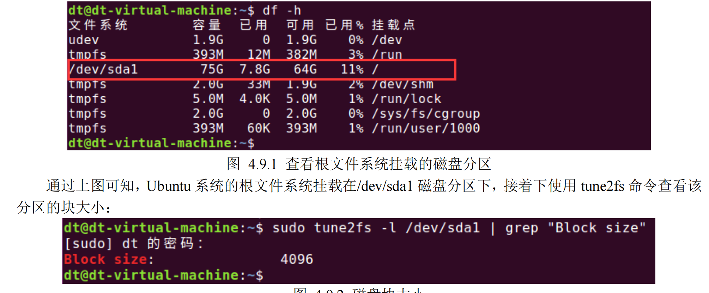

# 直接 I/O：绕过内核缓冲

从 Linux 内核 2.4 版本开始，Linux 允许应用程序在执行文件 I/O 操作时绕过内核缓冲区，从用户空间

直接将数据传递到文件或磁盘设备，把这种操作也称为直接 I/O（direct I/O）或裸 I/O（raw I/O）。

在有些情况下，这种操作通常是很有必要的，例如，某应用程序的作用是测试磁盘设备的读写速率，那

么在这种应用需要下，我们就需要保证 read/write 操作是直接访问磁盘设备，而不经过内核缓冲，如果不能

得到这样的保证，必然会导致测试结果出现比较大的误差。

然后，对于大多数应用程序而言，使用直接 I/O 可能会大大降低性能，这是因为为了提高 I/O 性能，内

核针对文件 I/O 内核缓冲区做了不少的优化，譬如包括按顺序预读取、在成簇磁盘块上执行 I/O、允许访问

同一文件的多个进程共享高速缓存的缓冲区。如果应用程序使用直接 I/O 方式，将无法享受到这些优化措施

所带来的性能上的提升，直接 I/O 只在一些特定的需求场合，譬如磁盘速率测试工具、数据库系统等。

我们可针对某一文件或块设备执行直接 I/O，要做到这一点，需要在调用 open()函数打开文件时，指定

O\_DIRECT 标志，该标志至 Linux 内核 2.4.10 版本开始生效，譬如：

fd = open(filepath, O\_WRONLY | O\_DIRECT);

## 直接 I/O 的对齐限制

因为直接 I/O 涉及到对磁盘设备的直接访问，所以在执行直接 I/O 时，必须要遵守以下三个对齐限制要

求：

1. ⚫ 应用程序中用于存放数据的缓冲区，其内存起始地址必须以块大小的整数倍进行对齐；
2. ⚫ 写文件时，文件的位置偏移量必须是块大小的整数倍；
3. ⚫ 写入到文件的数据大小必须是块大小的整数倍。

如果不满足以上任何一个要求，调用 write()均为以错误返回 Invalid argument。以上所说的块大小指的

是磁盘设备的物理块大小（block size），常见的块大小包括 512 字节、1024 字节、2048 以及 4096 字节，那

我们如何确定磁盘分区的块大小呢？可以使用 tune2fs 命令进行查看，如下所示：

tune2fs -l /dev/sda1 | grep "Block size"

-l 后面指定了需要查看的磁盘分区，可以使用 df -h 命令查看 Ubuntu 系统的根文件系统所挂载的磁盘分

区：



图 4.9.2 磁盘块大小

从上图可知/dev/sda1 磁盘分区的块大小为 4096 个字节。

直接 I/O 测试与普通 I/O 对比测试

接下来编写一个使用直接 I/O 方式写文件的测试程序和一个使用普通 I/O 方式写文件的测试程序，进行

对比。

> 示例代码 4.9.2 演示了以直接 I/O 方式写文件的操作，首先我们需要在程序开头处定义一个宏定义\_GNU\_SOURCE，原因在于后面 open()函数需要指定 O\_DIRECT 标志，这个宏需要我们在程序中定义了O\_DIRECT 宏之后才能使用，否则编译程序就会报错提示：O\_DIRECT 未定义。

Tips：\_GNU\_SOURCE 宏可用于开启/禁用 Linux 系统调用和 glibc 库函数的一些功能、特性，要打开这

些特性，需要在应用程序中定义该宏，定义该宏之后意味着用户应用程序打开了所有的特性；默认情况下，

_GNU_SOURCE 宏并没有被定义，所以当使用到它控制的一些特性时，应用程序编译将会报错！定义该宏

的方式有两种：

⚫ 直接在源文件中定义：#define \_GNU\_SOURCE

⚫ gcc 编译时使用-D 选项定义\_GNU\_SOURCE 宏：

gcc -D\_GNU\_SOURCE -o testApp testApp.c

gcc 的-D 选项可用于定义一个宏，并且该宏定义在整个源码工程中都是生效的，是一个全局宏定义。使

用以上哪种方式都可以。

示例代码 4.9.2 直接 I/O 示例程序

```c
/\*\* 使用宏定义 O\_DIRECT 需要在程序中定义宏\_GNU\_SOURCE

\*\* 不然提示 O\_DIRECT 找不到 \*\*/

#define _GNU_SOURCE

#include <stdio.h>

#include <stdlib.h>

#include <sys/types.h>

#include <sys/stat.h>

#include <fcntl.h>

#include <unistd.h>

/\*\* 定义一个用于存放数据的 buf，起始地址以 4096 字节进行对其 \*\*/

static char buf[8192] __attribute((aligned (4096)));

int main(void)

{

int fd;

int count;

/\* 打开文件 \*/

fd = open("./test\_file",

O\_WRONLY | O\_CREAT | O\_TRUNC | O\_DIRECT,

0664);

if (0 > fd) {

perror("open error");

exit(-1);

}

/\* 写文件 \*/

count = 10000;

while(count--) {

if (4096 != write(fd, buf, 4096)) {

perror("write error");

exit(-1);

}

}

/\* 关闭文件退出程序 \*/

close(fd);

exit(0);

}
```

前面提到过，使用直接 I/O 方式需要满足 3 个对齐要求，程序中定义了一个 static 静态数组 buf，将其

作为数据存放的缓冲区，在变量定义后加了\_\_attribute((aligned (4096)))修饰

> ### 使其起始地址以 4096 字节进行对其。

Tips：\_\_attribute 是 gcc 支持的一种机制（也可以写成\_\_attribute\_\_），可用于设置函数属性、变量属性

以及类型属性等，对此不了解的读者请自行查找资料学习，本书不会对此进行介绍！

程序中调用 open()函数是指定了 O\_DIRECT 标志，使用直接 I/O，最后通过 while 循环，将数据写入文

件中，循环 10000 次，每次写入 4096 个字节数据，也就是总共写入 4096\*10000 个字节（约等于 40MB）。

首次调用 write()时其文件读写位置偏移量为 0，之后均以 4096 字节进行递增，所以满足直接 I/O 方式的位

置偏移量必须是块大小的整数倍这个要求；每次写入大小均是 4096 字节，所以满足了数据大小必须是块大

小的整数倍这个要求。

接下来编译测试：

图 4.9.3 直接 I/O 测试结果

通过 time 命令测试可知，每次执行程序需要花费 2.7 秒左右的时间，使用直接 I/O 方式向文件写入约

40MB 数据大小。

Tips：对于直接 I/O 方式的 3 个对齐限制，大家可以自行进行验证，譬如修改上述示例代码使之不满足

3 个对齐条件种的任何一个，然后编译程序进行测试，会发生 write()函数会报错，均是“Invalid argument”错

误。

对示例代码 4.9.2 进行修改，使其变成普通 I/O 方式，其它功能相同，最终修改后的示例代码如下所示：

示例代码 4.9.3 普通 I/O 方式

#include <stdio.h>

#include <stdlib.h>

#include <sys/types.h>

#include <sys/stat.h>

#include <fcntl.h>

#include <unistd.h>

static char buf[8192];

int main(void)

{

int fd;

int count;

/\* 打开文件 \*/

fd = open("./test\_file", O\_WRONLY | O\_CREAT | O\_TRUNC, 0664);

if (0 > fd) {

perror("open error");

exit(-1);

}

/\* 写文件 \*/

count = 10000;

while(count--) {//循环 10000 次，每次写入 4096 个字节数据

if (4096 != write(fd, buf, 4096)) {

perror("write error");

exit(-1);

}

}

/\* 关闭文件退出程序 \*/

close(fd);

exit(0);

}

再次进行测试：

图 4.9.4 普通 I/O 测试结果

使用 time 命令得到的程序运行时间大约是 0.13\~0.14 秒左右，相比直接 I/O 方式的 2.7 秒，时间上提升

了 20 倍左右（测试大小不同、每次写入的大小不同，均会导致时间上的差别），原因在于直接 I/O 方式每

次 write()调用均是直接对磁盘发起了写操作，而普通方式只是将用户空间下的数据拷贝到了文件 I/O 内核

缓冲区中，并没直接操作硬件，所以消耗的时间短，硬件操作占用的时间远比内存复制占用的时间大得多

直接 I/O 方式效率、性能比较低，绝大部分应用程序不会使用直接 I/O 方式对文件进行 I/O 操作，通常

只在一些特殊的应用场合下才可能会使用，那我们可以使用直接 I/O 方式来测试磁盘设备的读写速率，这种

测试方式相比普通 I/O 方式就会更加准确。
