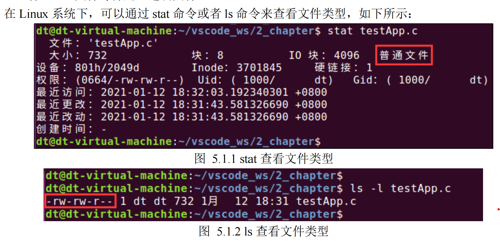

## **普通文件**

普通文件（regular file）在 Linux 系统下是最常见的，譬如文本文件、二进制文件，我们编写的源代码

文件这些都是普通文件，也就是一般意义上的文件。普通文件中的数据存在系统磁盘中，可以访问文件中的

内容，文件中的内容以字节为单位进行存储于访问。

普通文件可以分为两大类：文本文件和二进制文件。

⚫ 文本文件：文件中的内容是由文本构成的，所谓文本指的是 ASCII 码字符。文件中的内容其本质

上都是数字（因为计算机本身只有 0 和 1，存储在磁盘上的文件内容也都是由 0 和 1 所构成），而

文本文件中的数字应该被理解为这个数字所对应的 ASCII 字符码；譬如常见的.c、.h、.sh、.txt 等

这些都是文本文件，文本文件的好处就是方便人阅读、浏览以及编写。

⚫ 二进制文件：二进制文件中存储的本质上也是数字，只不过对于二进制文件来说，这些数字并不是

文本字符编码，而是真正的数字。譬如 Linux 系统下的可执行文件、C 代码编译之后得到的.o 文

件、.bin 文件等都是二进制文件。

stat 命令非常友好，会直观把文件类型显示出来；对于 ls 命令来说，并没有直观的显示出文件的类型，

而是通过符号表示出来，在图 5.1.2 中画红色框位置显示出的一串字符中，其中第一个字符（' - '）就用于表

示文件的类型，减号' - '就表示该文件是一个普通文件；除此之外，来看看其它文件类型使用什么字符表示：

⚫ ' - '：普通文件

⚫ ' d '：目录文件

⚫ ' c '：字符设备文件

⚫ ' b '：块设备文件

⚫ ' l '：符号链接文件

⚫ ' s '：套接字文件

⚫ ' p '：管道文件

关于普通文件就给大家介绍这么多
