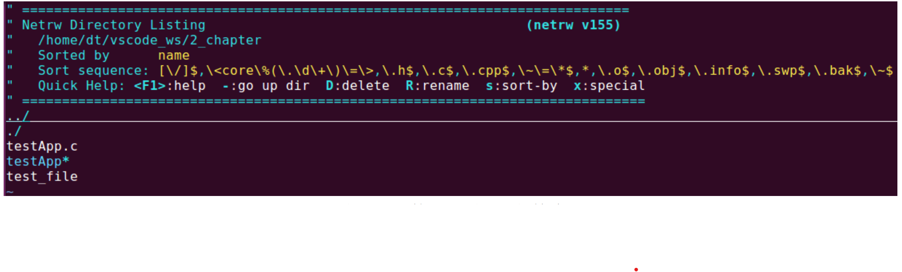

目录文件

目录（directory）就是文件夹，文件夹在 Linux 系统中也是一种文件，是一种特殊文件，同样我们也可

以使用 vi 编辑器来打开文件夹，如下所示：

图 5.1.3 使用 vi 打开文件夹

可以看到，文件夹中记录了该文件夹本省的路径以及该文件夹下所存放的文件。文件夹作为一种特殊文

件，本身并不适合使用前面给大家介绍的文件 I/O 的方式来读写，在 Linux 系统下，会有一些专门的系统调

用用于读写文件夹，这部分内容后面再给大家介绍
