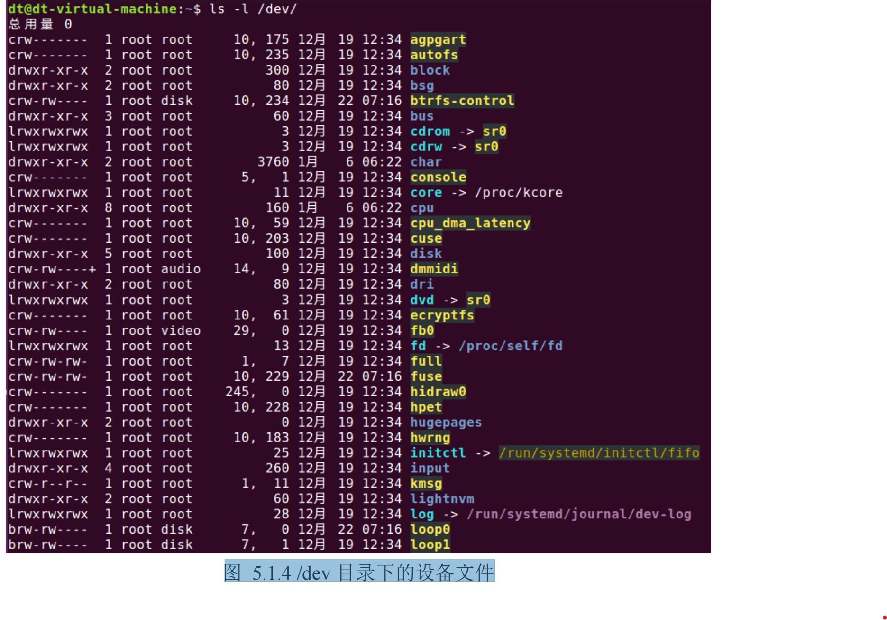

## 字符设备文件和块设备文件

学过 Linux 驱动编程开发的读者，对字符设备文件（character）、块设备文件（block）这些文件类型应

该并不陌生，Linux 系统下，一切皆文件，也包括各种硬件设备。设备文件（字符设备文件、块设备文件）

对应的是硬件设备，在 Linux 系统中，硬件设备会对应到一个设备文件，应用程序通过对设备文件的读写来

操控、使用硬件设备，譬如 LCD 显示屏、串口、音频、按键等，在本教程的进阶篇内容中，将会向大家介

绍如何通过设备文件操控、使用硬件设备。

Linux 系统中，可将硬件设备分为字符设备和块设备，所以就有了字符设备文件和块设备文件两种文件

类型。虽然有设备文件，但是设备文件并不对应磁盘上的一个文件，也就是说设备文件并不存在于磁盘中，

而是由文件系统虚拟出来的，一般是由内存来维护，当系统关机时，设备文件都会消失；字符设备文件一般

存放在 Linux 系统/dev/目录下，所以/dev 也称为虚拟文件系统 devfs。以 Ubuntu 系统为例，如下所示：

图 5.1.4 /dev 目录下的设备文件

上图中 agpgart、autofs、btrfs-control、console 等这些都是字符设备文件，而 loop0、loop1 这些便是块设

备文件。
