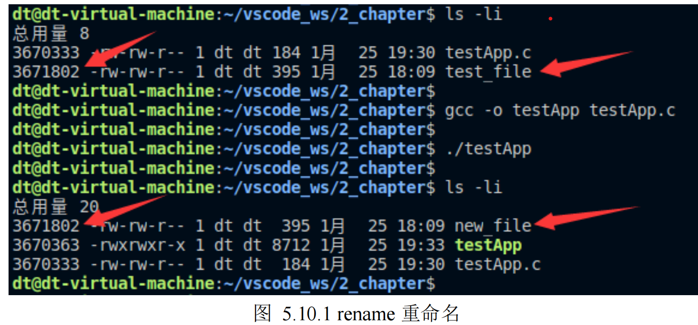

## 文件重命名

本小节给大家介绍 rename()`系统调用`，

借助于 rename()既可以对文件进行重命名，又可以将文件移至同一文件系统中的另一个目录下，

其函数原型如下所示：

#include <stdio.h>

int rename(const char \*oldpath, const char \*newpath);

使用该函数需要包含头文件<stdio.h>。

函数参数和返回值含义如下：

oldpath：原文件路径。

newpath：新文件路径。

返回值：成功返回 0；失败将返回-1，并设置 errno。

调用 rename()会将现有的一个路径名 oldpath 重命名为 newpath 参数所指定的路径名。

`rename()调用仅操作目录条目，而不移动文件数据（不改变文件 inode 编号、不移动文件数据块中存储的内容），`重命名既

`不影响指向该文件的其它硬链接，也不影响已经打开该文件的进程（譬如，在重命名之前该文件已被其它进程打开了，而且还未被关闭）。`

根据 oldpath、newpath 的不同，有以下不同的情况需要进行说明：

⚫ 若 newpath 参数指定的文件或目录已经存在，则将其覆盖；

⚫ 若 newpath 和 oldpath 指向同一个文件，则不发生变化（且调用成功）。

⚫ rename()系统调用对其两个参数中的软链接均不进行解引用。如果 oldpath 是一个软链接，那么将

重命名该软链接；如果 newpath 是一个软链接，则会将其移除、被覆盖。

⚫ 如果 oldpath 指代文件，而非目录，那么就不能将 newpath 指定为一个目录的路径名。要想重命名

一个文件到某一个目录下，newpath 必须包含新的文件名。

⚫ 如果 oldpath 指代为一个目录，在这种情况下，newpath 要么不存在，要么必须指定为一个空目录。

⚫ oldpath 和 newpath 所指代的文件必须位于同一文件系统。由前面的介绍，可以得出此结论！

⚫ 不能对.（当前目录）和..（上一级目录）进行重命名。

测试

示例代码 5.10.1 rename 函数使用示例

#include <stdio.h>

#include <stdlib.h>

int main(void)

{

int ret;

ret = rename("./test\_file", "./new\_file");

if (-1 == ret) {

perror("rename error");

exit(-1);

}

exit(0);

}

将当前目录下的 test\_file 文件重命名为 new\_file，接下来编译测试：

从图中可以知道，`使用 rename 进行文件重命名之后，其 inode 号并未改变。`
