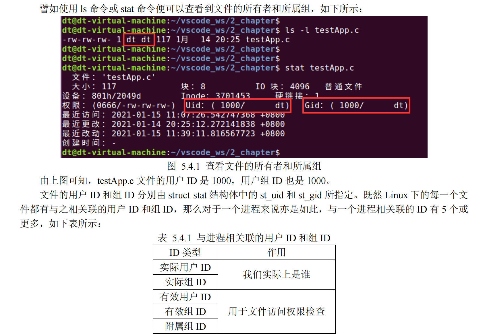

Linux 是一个多用户操作系统，系统中一般存在着好几个不同的用户，而 Linux 系统中的每一个文件都

有一个与之相关联的用户和用户组，通过这个信息可以判断文件的所有者和所属组。

文件所有者表示该文件属于“谁”，也就是属于哪个用户。一般来说文件在创建时，其所有者就是创建

该文件的那个用户。譬如，当前登录用户为 dt，使用 touch 命令创建了一个文件，那么这个文件的所有者就

是 dt；同理，在程序中调用 open 函数创建新文件时也是如此，执行该程序的用户是谁，其文件所有者便是

谁。

文件所属组则表示该文件属于哪一个用户组。在 Linux 中，系统并不是通过用户名或用户组名来识别不

同的用户和用户组，而是通过 ID。ID 就是一个编号，Linux 系统会为每一个用户或用户组分配一个 ID，将

用户名或用户组名与对应的 ID 关联起来，所以系统通过用户 ID（UID）或组 ID（GID）就可以识别出不同

的用户和用户组。

Tips：用户 ID 简称 UID、用户组 ID 简称 GID。这些都是 Linux 操作系统的基础知识，如果对用户和用

户组的概念尚不熟悉，建议先自行学习这些基础知识。

⚫ 实际用户 ID 和实际组 ID 标识我们究竟是谁，也就是执行该进程的用户是谁、以及该用户对应的

所属组；实际用户 ID 和实际组 ID 确定了进程所属的用户和组。

⚫ 进程的有效用户 ID、有效组 ID 以及附属组 ID 用于文件访问权限检查，详情请查看 5.4.1 小节内

容。
