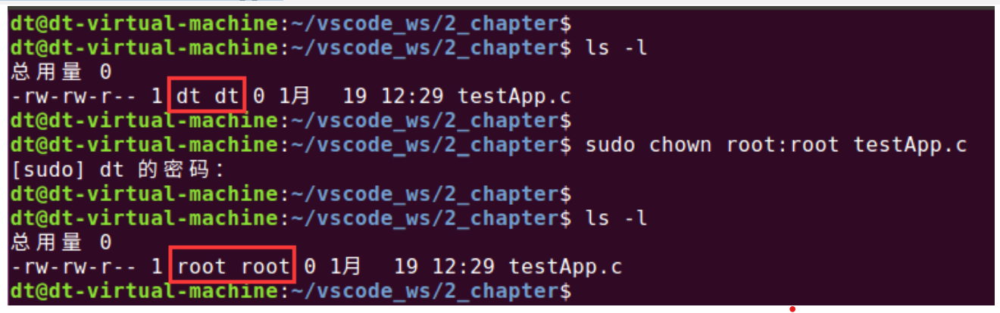

## chown 函数

chown 是一个系统调用，该系统调用可用于改变文件的所有者（用户 ID）和所属组（组 ID）。其实在

Linux 系统下也有一个 chown 命令，该命令的作用也是用于改变文件的所有者和所属组，譬如将 testApp.c

文件的所有者和所属组修改为 root：

`sudo chown root:root testApp.c`

图 5.4.2 使用 chown 命令修改文件所有者和所属组

可以看到，通过该命令确实可以改变文件的所有者和所属组，这个命令内部其实就是调用了 chown 函

数来实现功能的，chown 函数原型如下所示（可通过"man 2 chown"命令查看）：

#include <unistd.h>

int chown(const char \*pathname, uid\_t owner, gid\_t group);

首先，使用该命令需要包含头文件<unistd.h>。

函数参数和返回值如下所示：

pathname：用于指定一个需要修改所有者和所属组的文件路径。

owner：将文件的所有者修改为该参数指定的用户（以用户 ID 的形式描述）；

group：将文件的所属组修改为该参数指定的用户组（以用户组 ID 的形式描述）；

返回值：成功返回 0；失败将返回-1，兵并且会设置 errno。

该函数的用法非常简单，只需指定对应的文件路径以及相应的 owner 和 group 参数即可！如果只需要修

改文件的用户 ID 和用户组 ID 当中的一个，那么又该如何做呢？方法很简单，只需将其中不用修改的 ID（用

户 ID 或用户组 ID）与文件当前的 ID（用户 ID 或用户组 ID）保持一致即可，即调用 chown 函数时传入的

用户 ID 或用户组 ID 就是该文件当前的用户 ID 或用户组 ID，而文件当前的用户 ID 或用户组 ID 可以通过

stat 函数查询获取。

虽然该函数用法很简单，但是有以下两个限制条件：

⚫ 只有超级用户进程能更改文件的用户 ID；

⚫ 普通用户进程可以将文件的组 ID 修改为其所从属的任意附属组 ID，前提条件是该进程的有效用

户 ID 等于文件的用户 ID；而超级用户进程可以将文件的组 ID 修改为任意值。

所以，由此可知，文件的用户 ID 和组 ID 并不是随随便便就可以更改的，其实这种设计是为系统安全

着想，如果系统中的任何普通用户进程都可以随便更改系统文件的用户 ID 和组 ID，那么也就意味着任何普

通用户对系统文件都有任意权限了，这对于操作系统来说将是非常不安全的。

测试

接下来看一些 chown 函数的使用例程，如下所示：

示例代码 5.4.1 chown 函数使用示例

#include <unistd.h>

#include <stdio.h>

#include <stdlib.h>

int main(void)

{

if (-1 == chown("./test\_file", 0, 0)) {

perror("chown error");

exit(-1);

}

exit(0);

}

代码很简单，直接调用 chown 函数将 test\_file 文件的用户 ID 和用户组 ID 修改为 0、0。0 指的就是 root

用户和 root 用户组，接下来我们测试下：

图 5.4.3 chown 测试结果

在运行测试代码之前，先使用了 stat 命令查看到 test\_file 文件的用户 ID 和用户组 ID 都等于 1000，然

后执行测试程序，结果报错"Operation not permitted"，显示不允许操作；接下来重新执行程序，此时加上 sudo，

如下：

图 5.4.4 chown 测试结果 2

此时便可以看到，执行之后没有打印错误提示信息，说明 chown 函数调用成功了，并且通过 stat 命令

也可以看到文件的用户 ID 和组 ID 确实都被修改为 0 了（也就是 root 用户）。原因在于，加上 sudo 执行应

用程序，而此时应用程序便可以临时获得 root 用户的权限，也就是会以 root 用户的身份运行程序，也就意

味着此时该应用程序的用户 ID（也就是前面给大家提到的实际用户 ID）变成了 root 超级用户的 ID（也就

是 0），自然 chown 函数便可以调用成功。

在 Linux 系统下，可以使用 getuid 和 getgid 两个系统调用分别用于获取当前进程的用户 ID 和用户组

ID，这里说的进程的用户 ID 和用户组 ID 指的就是进程的实际用户 ID 和实际组 ID，这两个系统调用函数

原型如下所示：

#include <unistd.h>

#include <sys/types.h>

uid\_t getuid(void);

gid\_t getgid(void);

我们可以在示例代码 5.4.1 中加入打印用户 ID 的语句，如下所示：

示例代码 5.4.2 chown 使用示例 2

#include <unistd.h>

#include <stdio.h>

#include <stdlib.h>

int main(void)

{

printf("uid: %d\\n", getuid());

if (-1 == chown("./test\_file", 0, 0)) {

perror("chown error");

exit(-1);

}

exit(0);

}

再来重复上面的测试：

图 5.4.5 chown 测试结果 3

很明显可以看到两次执行同一个应用程序它们的用户 ID 是不一样的，因为加上了 sudo 使得应用程序

的用户 ID 由原本的普通用户 ID 1000 变成了超级用户 ID 0，使得该进程变成了超级用户进程，所以调用

chown 函数就不会报错。

关于 chown 就给大家介绍这么多，在实际应用编程中，此系统调用被用到的概率并不多，但是理论性

知识还是得知道。
