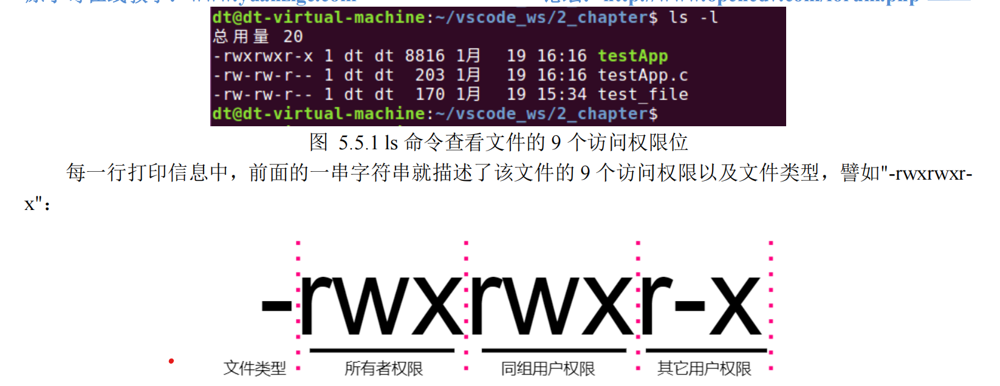

普通权限和特殊权限

文件的权限可以分为两个大类，分别是普通权限和特殊权限（也可称为附加权限）。普通权限包括对文

件的读、写以及执行，而特殊权限则包括一些对文件的附加权限，譬如Set-User-ID、Set-Group-ID以及Sticky。

接下来，分别对普通权限和特殊权限进行介绍。

普通权限

每个文件都有 9 个普通的访问权限位，可将它们分为 3 类，如下表：

| 权限宏  | 含义               |
| ------- | ------------------ |
| S_IRUSR | 文件所有者读权限   |
| S_IWUSR | 文件所有者写权限   |
| S_IXUSR | 文件所有者执行权限 |
| S_IRGRP | 同组用户读权限     |
| S_IWGRP | 同组用户写权限     |
| S_IXGRP | 同组用户执行权限   |
| S_IROTH | 其它用户读权限     |
| S_IWOTH | 其它用户写权限     |
| S_IXOTH | 其它用户执行权限   |

表 5.5.1 9 个文件访问权限位

譬如使用 ls 命令或 stat 命令可以查看到文件的这 9 个访问权限，如下所示：

图 5.5.2 文件权限位

最前面的一个字符表示该文件的类型，这个前面给大家介绍过，" - "表示该文件是一个普通文件。

r 表示具有读权限；

w 表示具有写权限；

x 表示具有执行权限；

-表示无此权限。

当进程每次对文件进行读、写、执行等操作时，内核就会对文件进行访问权限检查，以确定该进程对文

件是否拥有相应的权限。而文件的权限检查就涉及到了文件的所有者（st\_uid）、文件所属组（st\_gid）以及

其它用户，当然这里指的是从文件的角度来看；而对于进程来说，参与文件权限检查的是进程的有效用户、

有效用户组以及进程的附属组用户。

如何判断权限，首先要搞清楚该进程对于需要进行操作的文件来说是属于哪一类“角色”：

⚫ 如果进程的有效用户 ID 等于文件所有者 ID（st\_uid），意味着该进程以文件所有者的角色存在；

⚫ 如果进程的有效用户 ID 并不等于文件所有者 ID，意味着该进程并不是文件所有者身份；但是进程

的有效用户组 ID 或进程的附属组 ID 之一等于文件的组 ID（st\_gid），那么意味着该进程以文件所

属组成员的角色存在，也就是文件所属组的同组用户成员。

⚫ 如果进程的有效用户 ID 不等于文件所有者 ID、并且进程的有效用户组 ID 或进程的所有附属组 ID

均不等于文件的组 ID（st\_gid），那么意味着该进程以其它用户的角色存在。

⚫ 如果进程的有效用户 ID 等于 0（root 用户），则无需进行权限检查，直接对该文件拥有最高权限。

确定了进程对于文件来说是属于哪一类“角色”之后，相应的权限就直接“对号入座”即可。接下来聊

一聊文件的附加的特殊权限。

特殊权限

st\_mode 字段中除了记录文件的 9 个普通权限之外，还记录了文件的 3 个特殊权限，也就是图 5.2.1 中

所表示的 S 字段权限位，S 字段三个 bit 位中，从高位到低位依次表示文件的 set-user-ID 位权限、set-group

ID 位权限以及 sticky 位权限，如下所示：

表 5.5.2 文件的特殊权限位

这三种权限分别使用 S\_ISUID、S\_ISGID 和 S\_ISVTX 三个宏来表示：

同样，以上数字使用的是八进制方式表示。对应的 bit 位数字为 1，则表示设置了该权限、为 0 则表示

并未设置该权限；譬如通过 st\_mode 变量判断文件是否设置了 set-user-ID 位权限，代码如下：

if (st.st\_mode & S\_ISUID) {

//设置了 set-user-ID 位权限

} else {

//没有设置 set-user-ID 位权限

}

这三个权限位具体有什么作用呢？接下里给大家简单地介绍一下：

⚫ 当进程对文件进行操作的时候、将进行权限检查，如果文件的 set-user-ID 位权限被设置，内核会将

进程的有效 ID 设置为该文件的用户 ID（文件所有者 ID），意味着该进程直接获取了文件所有者

的权限、以文件所有者的身份操作该文件。

⚫ 当进程对文件进行操作的时候、将进行权限检查，如果文件的 set-group-ID 位权限被设置，内核会

将进程的有效用户组 ID 设置为该文件的用户组 ID（文件所属组 ID），意味着该进程直接获取了

文件所属组成员的权限、以文件所属组成员的身份操作该文件。

看到这里，大家可能就要问了，如果两个权限位同时被设置呢？关于这个问题，我们后面可以进行相应

的测试，答案自然会揭晓！

当然，set-user-ID 位和 set-group-ID 位权限的作用并不如此简单，关于其它的功能本文档便不再叙述了，

因为这些特殊权限位实际中用到的机会确实不多。除此之外，Sticky 位权限也不再给大家介绍了，笔者对此

也不是很了解，有兴趣的读者可以自行查阅相关的书籍。

Linux 系统下绝大部分的文件都没有设置 set-user-ID 位权限和 set-group-ID 位权限，所以通常情况下，

进程的有效用户等于实际用户（有效用户 ID 等于实际用户 ID），有效组等于实际组（有效组 ID 等于实际

组 ID）。
