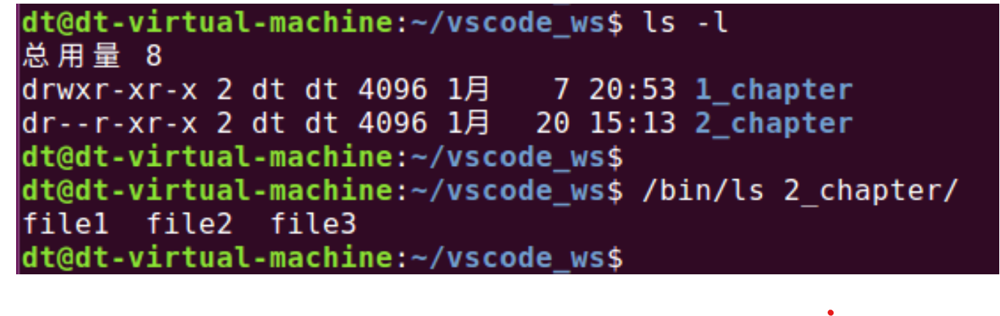

前面我们一直谈论的都是文件的读、写、执行权限，那对于创建文件、删除文件等这些操作难道就不需

要相应的权限了吗？事实并不如此，譬如：有时删除文件或创建文件也会提示"权限不够"，如下所示：

图 5.5.3 创建文件、删除文件

那说明删除文件、创建文件这些操作也是需要相应权限的，那这些权限又是从哪里获取的呢？答案就是

目录。目录（文件夹）在 Linux 系统下也是一种文件，拥有与普通文件相同的权限方案（S/U/G/O），只是

这些权限的含义另有所指。

⚫ 目录的读权限：可列出（譬如：通过 ls 命令）目录之下的内容（即目录下有哪些文件）。

⚫ 目录的写权限：可以在目录下创建文件、删除文件。

⚫ 目录的执行权限：可访问目录下的文件，譬如对目录下的文件进行读、写、执行等操作。

拥有对目录的读权限，用户只能查看目录中的文件列表，譬如使用 ls 命令进行查看：

图 5.5.4 只有读权限查看目录下的文件

通过"ls -l"命令可以查看到 2\_chapter 目录对于文件所有者只有读权限，当前操作的用户正是该目录所有

者 dt，之后通过"ls 2\_chapter"命令查看该目录下的文件，确实获取到了该目录下的 3 个文件：file1、file2、

file3，说明只有读权限时，可以查看到目录下有哪些文件、显示出文件的名称；但是会看到上面打印出了一

些"权限不够"信息，这是因为 Ubuntu 发行版对 ls 命令做了别名处理，执行 ls 命令的时候携带了一些选项，

而这些选项会访问文件的一些信息，所以导致出现"权限不够"问题，这也说明，只拥有读权限、是没法访问

目录下的文件的；为了确保使用的是 ls 命令本身，执行时需要给出路径的完整路径/bin/ls：

要想访问目录下的文件，譬如查看文件的 inode 节点、大小、权限等信息，还需要对目录拥有执行权限。

反之，若拥有对目录的执行权限、而无读权限，只要知道目录内文件的名称，仍可对其进行访问，但不

能列出目录下的内容（即目录下包含的其它文件的名称）。

要想在目录下创建文件或删除原有文件，需要同时拥有对该目录的执行和写权限。

所以由此可知，如果需要对文件进行读、写或执行等操作，不光是需要拥有该文件本身的读、写或执行

权限，还需要拥有文件所在目录的执行权限。
