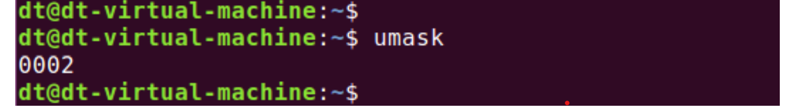

umask 函数

在 Linux 下有一个 umask 命令，在 Ubuntu 系统下执行看看：

图 5.5.8 运行 umask 命令

可以看到该命令打印出了"0002"，这数字表示什么意思呢？这就要从 umask 命令的作用说起了，umask

命令用于查看/设置权限掩码，权限掩码主要用于对新建文件的权限进行屏蔽。权限掩码的表示方式与文件

权限的表示方式相同，但是需要去除特殊权限位，umask 不能对特殊权限位进行屏蔽。

当新建文件时，文件实际的权限并不等于我们所设置的权限，譬如：调用 open 函数新建文件时，文件

实际的权限并不等于 mode 参数所描述的权限，而是通过如下关系得到实际权限：

mode & \~umask

譬如调用 open 函数新建文件时，mode 参数指定为 0777，假设 umask 为 0002，那么实际权限为：

0777 & (\~0002) = 0775

前面给大家介绍 open 函数的 mode 参数时，并未向大家提及到 umask，所以这里重新向大家说明。

umask 权限掩码是进程的一种属性，用于指明该进程新建文件或目录时，应屏蔽哪些权限位。进程的

umask 通常继承至其父进程（关于父、子进程相关的内容将会在后面章节给大家介绍），譬如在 Ubuntu shell

终端下执行的应用程序，它的 umask 继承至该 shell 进程。

当然，Linux 系统提供了 umask 函数用于设置进程的权限掩码，该函数是一个系统调用，函数原型如下

所示（可通过"man 2 umask"命令查看）：

#include <sys/types.h>

#include <sys/stat.h>

mode\_t umask(mode\_t mask);

首先，使用该命令需要包含头文件<sys/types.h>和<sys/stat.h>。

函数参数和返回值含义如下：

mask：需要设置的权限掩码值，可以发现 make 参数的类型与 open 函数、chmod 函数中的 mode 参数

对应的类型一样，所以其表示方式也是一样的，前面也给大家介绍了，既可以使用数字表示（譬如八进制数）

也可以直接使用宏（S\_IRUSR、S\_IWUSR 等）。

返回值：返回设置之前的 umask 值，也就是旧的 umask。

测试

接下来我们编写一个测试代码，使用 umask()函数修改进程的 umask 权限掩码，测试代码如下所示：

示例代码 5.5.3 umask 函数使用示例

#include <sys/types.h>

#include <sys/stat.h>

#include <stdio.h>

#include <stdlib.h>

int main(void)

{

mode\_t old\_mask;

old\_mask = umask(0003);

printf("old mask: %04o\\n", old\_mask);

exit(0);

}

上述代码中，使用 umask 函数将该进程的 umask 设置为 0003（八进制），返回得到的 old\_mask 则是设

置之前旧的 umask 值，然后将其打印出来：

图 5.5.9 umask 函数测试结果

从打印信息可以看出，旧的 umask 等于 0002，这个 umask 是从当前 vscode 的 shell 终端继承下来的，

如果没有修改进程的 umask 值，默认就是从父进程继承下来的 umask。

这里再次强调，umask 是进程自身的一种属性、A 进程的 umask 与 B 进程的 umask 无关（父子进程关

系除外）。在 shell 终端下可以使用 umask 命令设置 shell 终端的 umask 值，但是该 shell 终端关闭之后、再

次打开一个终端，新打开的终端将与之前关闭的终端并无任何瓜葛！
