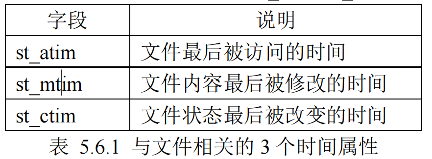
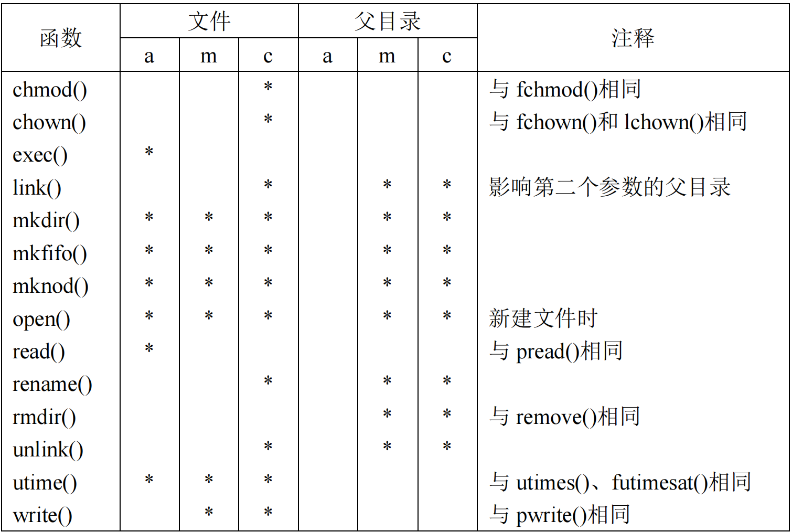

前面给大家介绍了 3 个文件的时间属性：文件最后被访问的时间、文件内容最后被修改的时间以及文

件状态最后被改变的时间，分别记录在 struct stat 结构体的 st\_atim、st\_mtim 以及 st\_ctim 变量中，如下所示：

⚫ 文件最后被访问的时间：访问指的是读取文件内容，文件内容最后一次被读取的时间，譬如使用

read()函数读取文件内容便会改变该时间属性；

⚫ 文件内容最后被修改的时间：文件内容发生改变，譬如使用 write()函数写入数据到文件中便会改变

该时间属性；

⚫ 文件状态最后被改变的时间：状态更改指的是该文件的 inode 节点最后一次被修改的时间，譬如更

改文件的访问权限、更改文件的用户 ID、用户组 ID、更改链接数等，但它们并没有更改文件的实

际内容，也没有访问（读取）文件内容。为什么文件状态的更改指的是 inode 节点的更改呢？3.1 小

节给大家介绍 inode 节点的时候给大家介绍过，inode 中包含了很多文件信息，譬如：文件字节大

小、文件所有者、文件对应的读/写/执行权限、文件时间戳（时间属性）、文件数据存储的 block

（块）等，所以由此可知，状态的更改指的就是 inode 节点内容的更改。譬如 chmod()、chown()等

这些函数都能改变该时间属性。

表 5.6.2 列出了一些系统调用或 C 库函数对文件时间属性的影响，有些操作并不仅仅只会影响文件本

身的时间属性，还会影响到其父目录的相关时间属性

