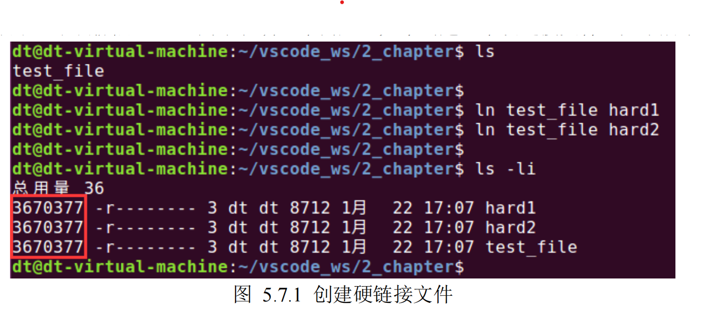
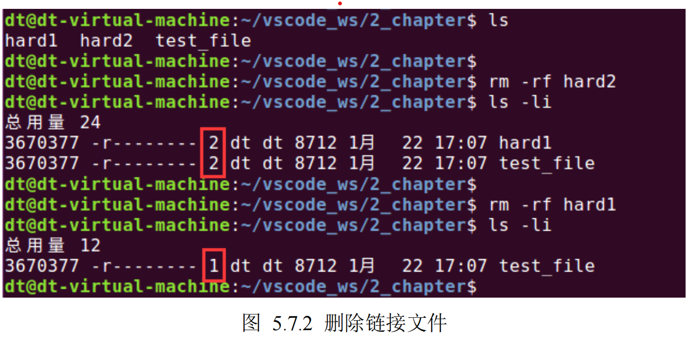
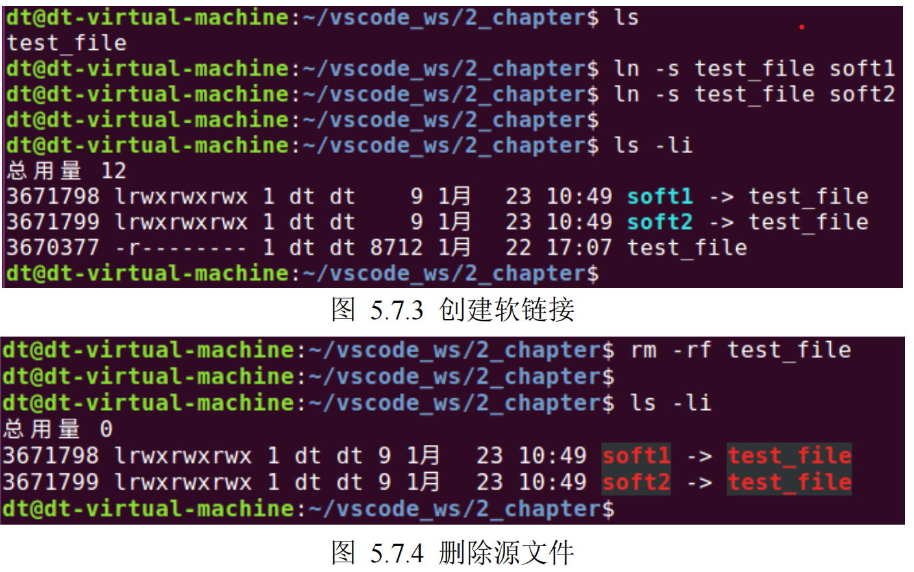

## 符号链接（软链接）与硬链接

在 Linux 系统中有两种链接文件，分为软链接（也叫符号链接）文件和硬链接文件，软链接文件也就是

前面给大家的 Linux 系统下的七种文件类型之一，其作用类似于 Windows 下的快捷方式。那么硬链接文件

又是什么呢？本小节就来聊一聊它们之间的区别。

首先，从使用角度来讲，两者没有任何区别，都与正常的文件访问方式一样，支持读、写以及执行。那

它们的区别在哪呢？在底层原理上，为了说明这个问题，先来创建一个硬链接文件，如下所示：

Tips：使用 ln 命令可以为一个文件创建软链接文件或硬链接文件，用法如下：

硬链接：ln 源文件 链接文件

软链接：ln -s 源文件 链接文件

关于该命令其它用法，可以查看 man 手册。

从图 5.7.1 中可知，使用 ln 命令创建的两个硬链接文件与源文件 test\_file 都拥有相同的 inode 号，既然

inode 相同，也就意味着它们指向了物理硬盘的同一个区块，仅仅只是文件名字不同而已，创建出来的硬链

接文件与源文件对文件系统来说是完全平等的关系。那么大家可能要问了，如果删除了硬链接文件或源文

件其中之一，那文件所对应的 inode 以及文件内容在磁盘中的数据块会被文件系统回收吗？事实上并不会这

样，因为 inode 数据结结构中会记录文件的链接数，这个链接数指的就是硬链接数，struct stat 结构体中的

st\_nlink 成员变量就记录了文件的链接数，这些内容前面已经给大家介绍过了。

当为文件每创建一个硬链接，inode 节点上的链接数就会加一，每删除一个硬链接，inode 节点上的链接

数就会减一，直到为 0，inode 节点和对应的数据块才会被文件系统所回收，也就意味着文件已经从文件系

统中被删除了。从图 5.7.1 中可知，使用"ls -li"命令查看到，此时链接数为 3（dt 用户名前面的那个数字），

我们明明创建了 2 个链接文件，为什么链接数会是 3？其实源文件 test\_file 本身就是一个硬链接文件，所以

这里才是 3。

当我们删除其中任何一个文件后，链接数就会减少，如下所示：

接下来再来聊一聊软链接文件，软链接文件与源文件有着不同的 inode 号，如图 5.7.3 所示，所以也就

是意味着它们之间有着不同的数据块，但是软链接文件的数据块中存储的是源文件的路径名，链接文件可

以通过这个路径找到被链接的源文件，它们之间类似于一种“主从”关系，当源文件被删除之后，软链接文

件依然存在，但此时它指向的是一个无效的文件路径，这种链接文件被称为悬空链接，如图 5.7.4 所示。

从图中还可看出，inode 节点中记录的链接数并未将软链接计算在内。

介绍完它们之间的区别之后，大家可能觉得硬链接相对于软链接来说有较大的优势，其实并不是这样，

对于硬链接来说，存在一些限制情况，如下：

⚫ 不能对目录创建硬链接（超级用户可以创建，但必须在底层文件系统支持的情况下）。

⚫ 硬链接通常要求链接文件和源文件位于同一文件系统中。

而软链接文件的使用并没有上述限制条件，优点如下所示：

⚫ 可以对目录创建软链接；

⚫ 可以跨越不同文件系统；

⚫ 可以对不存在的文件创建软链接。
