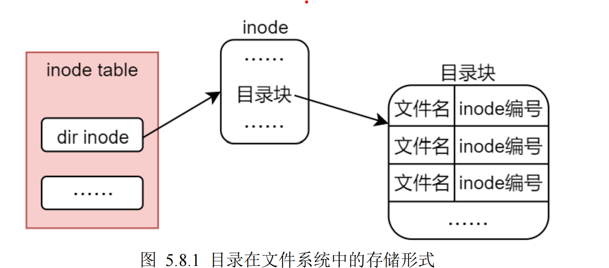

目录存储形式

3.1 小节中给大家介绍了普通文件的管理形式或存储形式，本小节聊一聊目录这种特殊文件在文件系统

中的存储形式，其实目录在文件系统中的存储方式与常规文件类似，常规文件包括了 inode 节点以及文件内

容数据存储块（block），参考图 3.1.1 所示；但对于目录来说，其存储形式则是由 inode 节点和目录块所构

成，目录块当中记录了有哪些文件组织在这个目录下，记录它们的文件名以及对应的 inode 编号。

其存储形式如下图所示：

目录块当中有多个目录项（或叫目录条目），每一个目录项（或目录条目）都会对应到该目录下的某一

个文件，目录项当中记录了该文件的文件名以及它的 inode 节点编号，所以通过目录的目录块便可以遍历找

到该目录下的所有文件以及所对应的 inode 节点。

所以对此总结如下：

⚫ 普通文件由 inode 节点和数据块构成

⚫ 目录由 inode 节点和目录块构成
