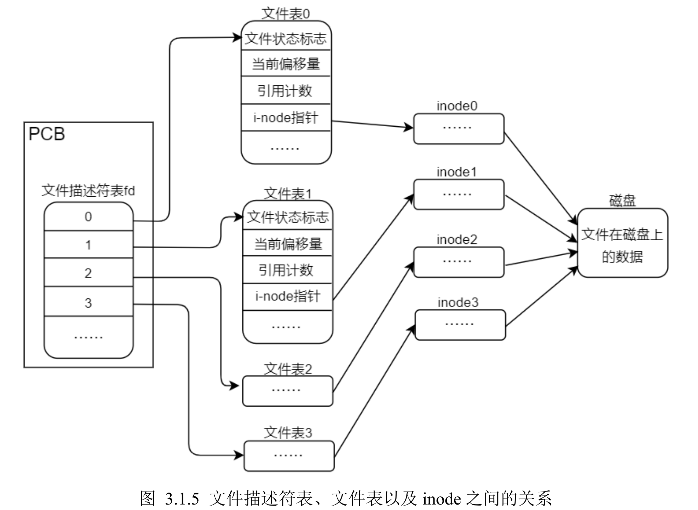

这段内容详细描述了文件在被打开时的状态以及操作系统如何管理文件的读写操作，以下是整理后的归纳总结：

### 1. 文件打开时的数据处理

- **内存中的缓冲区**：当调用`open`函数打开文件时，内核会在内存中申请缓冲区，将文件内容从磁盘（静态文件）读取到内存（动态文件）中。后续对文件的读写操作都是针对内存中的动态文件，而不是磁盘中的静态文件。
- **数据同步**：内核会在适当时机将内存中的动态文件内容同步到磁盘上。由于这种设计，文件打开或写入时系统效率更高。

### 2. 文件操作的延迟与数据丢失原因

- **打开大文件较慢**：因为文件数据需从磁盘读取并加载到内存。
- **数据未保存的丢失**：如果未手动保存文件或在断电等意外情况下关机，内存中的动态文件内容可能未同步到磁盘，导致未保存的数据丢失。

### 3. 文件缓冲机制的设计原因

- **块设备限制**：磁盘、硬盘、U盘等存储设备属于块设备，读写操作以块为单位进行，改动小量数据也需重写整个块，操作不灵活且较慢。 (常见为4KB，一个扇区0.5kb)
- **内存的灵活性**：内存支持按字节访问、随机读写，操作灵活、速率高。通过在内存中管理动态文件，操作系统可以提升文件读写性能。

### 4. 文件描述符及文件表管理

- **进程控制块（PCB）**：每个进程有自己的PCB，包含该进程的状态、特征等。
- **文件描述符表**：PCB中有指针指向文件描述符表，文件描述符表记录进程打开的所有文件，每个文件描述符指向一个文件表。
- **文件表**：记录文件状态标志、引用计数、文件读写偏移量、inode指针等。文件表的inode指针指向文件的inode，用于获取文件在磁盘上的存储位置。

### 5. 总结

了解文件的打开、读写和缓存过程，有助于理解文件I/O操作的底层原理。虽然这些内容在日常编程中不直接影响代码编写，但掌握其原理有助于更好地理解文件操作效率、数据同步与存储设备的工作方式。
