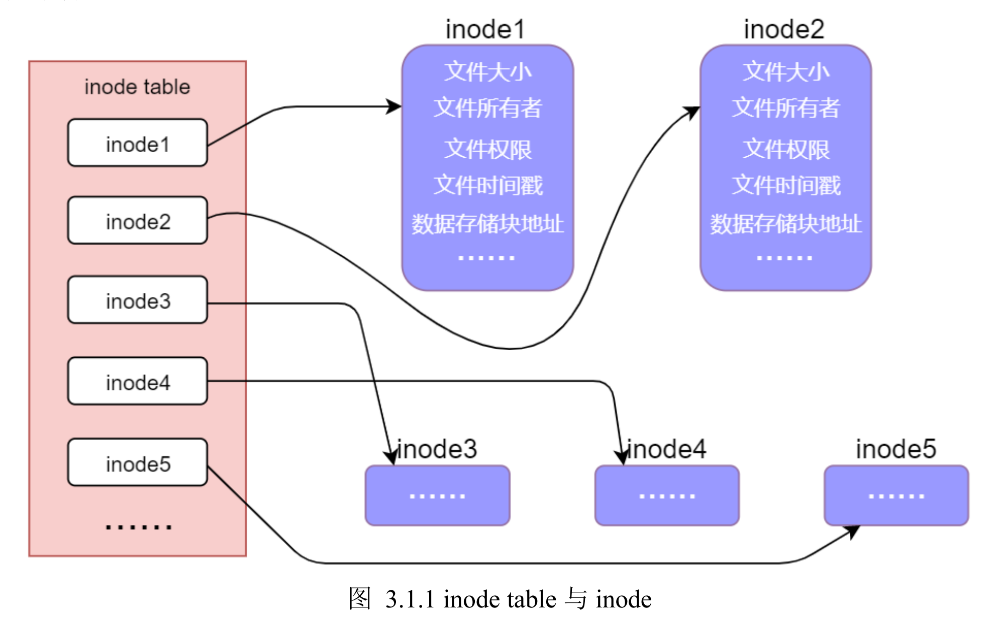
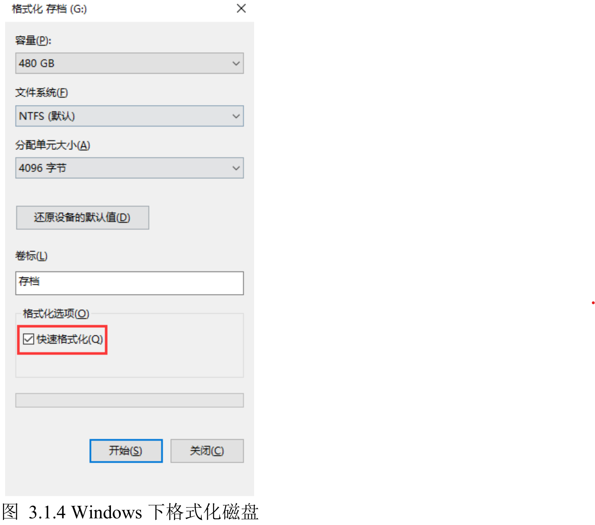
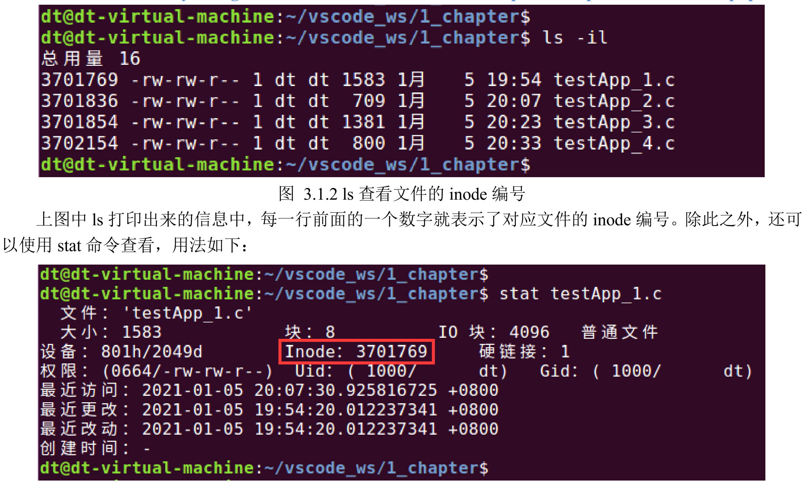

这段内容主要讲述了文件系统中文件的存储结构及查找过程，可以归纳为以下几点：

### 1. 文件的存储位置和结构

- **存储位置**：文件通常存放在磁盘（如硬盘、U盘）中，未打开时被称为静态文件。
- **存储单位**：硬盘的最小存储单位是“扇区”（Sector），每个扇区存储512字节。操作系统通过“块”（Block）而非单个扇区读取数据，一个块通常由多个扇区组成，最常见大小为4KB（即8个扇区）。

### 2. 磁盘的分区结构

- **数据区和inode区**：磁盘在分区、格式化时会分为“数据区”和“inode区”。数据区用于存储文件内容，而inode区用于存放文件的元数据。

### 3. inode及inode table

- **inode的作用**：每个文件对应一个inode，inode是一个结构体，包含文件的元数据（如大小、权限、时间戳、数据块位置等）。
- **inode table**：inode的集合称为inode table，用于定位文件数据在磁盘中的存储位置。
- **文件查找**：每个文件有唯一的inode编号，通过文件名查找到inode编号，再根据该编号在inode table中找到对应的inode，从而定位到文件数据所在的块。

### 4. 文件查找流程

打开文件的流程分为三步：

1. 通过文件名找到inode编号。
2. 根据inode编号在inode table中找到对应的inode。
3. 读取inode中记录的block位置并读取数据。

### 5. 文件系统的格式化方式

- **快速格式化**：仅清空inode table，数据区未被擦除，因此数据可恢复。
- **普通格式化**：彻底清空数据区和inode table，因此数据恢复难度较高。

### 实际操作

- 在Linux下使用`ls -i`或`stat`命令可以查看文件的inode编号。

